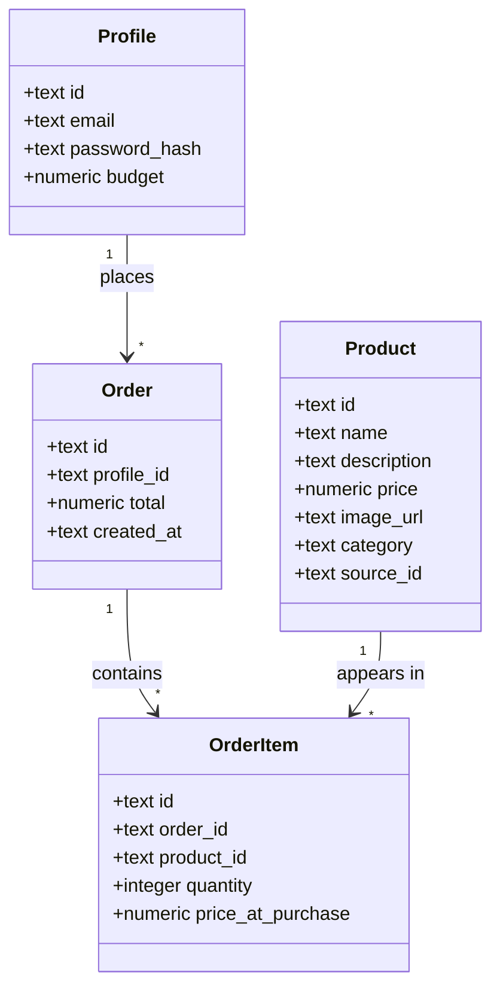

# Architecture

## Overview
```
Browser  <-->  Next.js app  <-->  SQLite (local file database)
                    |
                    +-->  Furniture shop's catalogue API (live, for browsing)
                    +-->  Furniture shop's ledger API (live, for balance)
                    +-->  Furniture shop's orders API (live, for "Buy" — really debits balance)
```
Next.js serves the pages and reads/writes a single local database file (`data/app.db`) for login and (as a best-effort mirror) order history. Some things are deliberately **not** authoritative locally, and instead come live from the shop's own API:
- the **product listing** (`/catalogue/search-index` — see "Browsing" below)
- the buyer's **remaining balance** (`/users/{user_id}` — see "Checkout with balance check" below)
- **"Buy" purchases** (`POST /orders` — see "Buying instantly" below) — this one genuinely debits the real balance, unlike cart checkout

There is no separate backend server and no cloud account to set up for the local database itself — it's just a file created automatically the first time the app runs.

**Important nuance on balance:** the real balance is tied to *one* account on the shop's side (identified by `PARTICIPANT_USER_ID`, resolved once via `POST /claim` with the registered event email) — it is not per-buyer. Every buyer signed up in this app sees the same figure. Both purchase paths call the shop's real Orders API and genuinely debit the shared balance, then mirror the result into our local `orders` table (including the shop's own `shop_order_id`, needed later for invoice lookup) purely so it shows up in this app's own order history:
- **"Buy" button** (per product, `app/buy-now-actions.ts`) calls `placeRealOrder` (single item).
- **Cart checkout** (`/cart`, `app/cart/actions.ts`) calls `placeRealOrderMulti` (all cart items in one real order).

`profiles.budget` (a local, per-buyer starting balance) still exists in the schema but is no longer used to compute what's shown or enforced — it's a leftover from before the real balance was wired in.

Login is hand-rolled rather than provided by a third party: passwords are hashed with `bcryptjs`, and once a buyer logs in, their session is stored in an encrypted browser cookie (`iron-session`) — no separate sessions table needed.

**Trade-off to know about:** because the database is a single local file, it only lives on whichever computer runs the app. It's not automatically shared between devices, and a serverless host like Vercel wouldn't keep the file around between requests. This setup is right for a Day 1 laptop demo; if this ever needs to run on a shared server, the database would need to move to a hosted service again.

## Data model (SQLite tables)

### Class diagram


**In plain English:**

There are four things the app needs to remember, matching the four ideas in the requirements (a buyer, a product, an order, and what's inside that order):

- **Profile** — one per buyer. Holds their login email and their password (as a one-way hash, never the plain password). This is the "who" of the app. It still has a `budget` column from before the shop's ledger API was wired in, but it's unused now — see the balance note above.
- **Product** — one per furniture item in the catalogue (name, price, description, category, photo). Loaded in bulk from a MongoDB source catalogue via `scripts/sync-catalog-from-mongo.mjs`, not added by hand.
- **Order** — created the moment a buyer checks out. It records who placed it, when, and the total amount — but not *what* was in it (that's the next box).
- **OrderItem** — the line items of an order: which product, how many, and the price it was sold at. Splitting this out from Order means one order can contain many products, and each product can appear in many orders over time.

The arrows show "one can have many": one Profile can place many Orders; one Order is made up of many OrderItems; one Product can show up in many OrderItems (across different buyers' orders). Nothing points back the other way — a Product doesn't need to know which orders it's in, the OrderItem rows already record that link.

One deliberate simplification: the shopping **cart** isn't a database table at all. While the buyer is adding items and adjusting quantities, that only lives in the browser's temporary memory. It only becomes real, permanent rows (one Order + several OrderItems) the moment they hit "checkout." This keeps the data model small — no need to track abandoned or in-progress carts for a Day 1 build.

**profiles**
| column | type | notes |
|---|---|---|
| id | text (uuid) | |
| email | text | unique |
| password_hash | text | never store the plain password |
| budget | numeric | remaining budget, starts at a default value |

**products**
| column | type | notes |
|---|---|---|
| id | text (uuid) | |
| name | text | |
| description | text | |
| price | numeric | |
| image_url | text | |
| category | text | |
| source_id | text | id from the Mongo source catalogue; lets re-imports update instead of duplicate |

**orders**
| column | type | notes |
|---|---|---|
| id | text (uuid) | |
| profile_id | text | which buyer placed it |
| total | numeric | |
| created_at | text (timestamp) | |

**order_items**
| column | type | notes |
|---|---|---|
| id | text (uuid) | |
| order_id | text | |
| product_id | text | |
| quantity | integer | |
| price_at_purchase | numeric | so later price changes don't rewrite history |

Access rule: unlike a hosted database, SQLite has no built-in per-user access rules — the app code itself is responsible for only ever reading/writing a buyer's own `profiles`, `orders`, and `order_items` rows (every query is written to filter by the logged-in buyer's id).

## Pages (Next.js App Router)
| route | purpose | status |
|---|---|---|
| `/login` | sign up / log in | built |
| `/` | product catalogue (redirects here to `/login` if not logged in) | built |
| `/cart` | current cart, running total vs. remaining balance, checkout | built |
| `/orders` | past orders for the logged-in buyer, plus total spent | built |
| `/product/[itemId]` | full detail + picture for one product | built |
| `/agent` | plain-English shopping assistant (chat) | built |
| `/invoices/[shopOrderId]` | proxies the real invoice PDF (route handler, not a page) | built |

## Key flows

**Login**
1. Buyer submits email/password on `/login`.
2. A server action looks up the `profiles` row by email and checks the password against the stored hash.
3. On success, the buyer's id is saved into an encrypted session cookie, and they're redirected to `/`.

**Browsing**
1. `/` calls the shop's catalogue API at `/catalogue/search-index` (`lib/catalogue-api.ts`), sending the `API_KEY` from `.env` as an `x-api-key` header. This endpoint is a lightweight listing meant for browsing (no images) — deliberately not the plain `/catalogue` endpoint, which is much slower.
2. The API response (category, name, price) is joined against our own `products` table by `source_id`/`item_id`, purely to fill in a photo and the internal id "Add to cart" needs — the catalogue API itself has no images.
3. Each product renders as a card (image if available, category, name, price) with an "Add to cart" button (needs a local match, see above) and a "Buy" button (works for any item — see "Buying instantly" below). The image and name both link to `/product/[itemId]` for the full detail view.

**Product detail**
1. `/product/[itemId]` calls `GET /catalogue/{item_id}` (`lib/catalogue-api.ts`) for full detail — category, name, price, dimensions, colours, and a link to the original IKEA listing.
2. The picture comes from `GET /catalogue/{item_id}/image` (linked directly as the `` — it returns raw image bytes, so there's no need to fetch/embed base64 JSON for this page). Neither endpoint needs the API key.
3. If the item doesn't exist (a 404 from the shop's API), the page shows a friendly "This item is no longer available" message instead of crashing; any other API failure shows a generic retry message.
4. The same "Add to cart" / "Buy" actions as the catalogue cards appear here too (`components/ProductActions.tsx`, shared by both).

**Buying instantly (real order)**
1. Clicking "Buy" on a product calls the `buyNow` server action (`app/buy-now-actions.ts`) directly — no cart, no confirmation step first.
2. That action calls the shop's real `POST /orders` with the item and quantity 1, passing an `Idempotency-Key` so an accidental retry can't double-charge. This actually debits the shared balance.
3. If the shop's API rejects it (e.g. insufficient balance, a 402 response), the card shows that error inline and nothing is charged.
4. On success, the card shows an inline confirmation (order id, amount charged, new balance), the purchase is mirrored into the local `orders`/`order_items` tables so it appears on `/orders` too, and the header's balance refreshes to match.

**Checkout with balance check**
1. Buyer adds products to the cart (kept in the browser via `localStorage`, not the database, until checkout — see `lib/cart-context.tsx`).
2. `/cart` shows each line item with a quantity stepper, the cart total, and the remaining balance fetched live from `GET /users/{user_id}` on the shop's API (`lib/ledger-api.ts`) — the same header/account for every buyer (see the balance note above).
3. If the cart total is more than the remaining balance, a clear message explains by how much, and the checkout button is disabled — the buyer must remove items to proceed.
4. If within budget, checkout calls the `placeOrder` server action (`app/cart/actions.ts`), which re-checks current prices and re-fetches the real balance itself (never trusting the browser's numbers), then creates one `orders` row and one `order_items` row per line item in a single transaction. If the balance API can't be reached, checkout shows a clear error instead of guessing.

## Folder structure
```
my-furniture-buyer-app/
  app/
    login/page.tsx        # login/signup form
    login/actions.ts       # server actions: authenticate, logout
    page.tsx                # home page / product catalogue
    product/[itemId]/page.tsx # product detail page (full info + picture)
    cart/page.tsx            # cart page (auth + balance guard, server component)
    cart/actions.ts           # server action: placeOrder (local-only, re-checks balance)
    buy-now-actions.ts         # server action: buyNow (real order via shop's Orders API, quantity-aware)
    agent/page.tsx              # shopping assistant chat page
    agent/actions.ts              # server action: sendAgentMessage (runs one agent turn)
    layout.tsx
  components/
    ProductCard.tsx         # grid card: image/name link to detail page + ProductActions
    ProductActions.tsx       # shared "Add to cart" + "Buy" buttons, confirmation UI
    HeaderAuth.tsx          # login/logout state + remaining balance in the header
    CartLink.tsx              # cart item count link in the header
    CartClient.tsx             # interactive cart list, quantities, checkout
    AgentChat.tsx               # chat UI: message list, tool-call trace, purchase-proposal card
  lib/
    db.ts                    # opens the local SQLite file, applies schema
    session.ts                # reads/writes the encrypted session cookie
    products.ts                # DisplayProduct type (for home page cards)
    catalogue-api.ts             # live product listing + single-product detail/image from the shop's API
    ledger-api.ts                  # fetches the real (live) balance from the shop's API
    orders-api.ts                    # places a real order via the shop's API (debits balance)
    agent-tools.ts                     # search_catalogue/get_product/check_balance/place_order + propose_purchase
    agent.ts                            # runAgentTurn: the Azure OpenAI tool-calling loop
    azure-openai-client.ts                # builds the Azure OpenAI SDK client from env
    env.ts                                  # central place environment variables are read from
    balance.ts                                # local "total spent so far" for the orders page
    cart-context.tsx                            # client-side cart state, backed by localStorage
  db/
    schema.sql                 # table definitions, applied automatically on startup
  scripts/
    sync-catalog-from-mongo.mjs   # one-off import from the MongoDB source catalogue
  data/
    app.db                         # the database file itself (not committed to git)
  requirements.md
  architecture.md
  CLAUDE.md
```

## AI agent tools + shopping assistant chat
`lib/agent-tools.ts` defines the four tools — `search_catalogue`, `get_product`, `check_balance`, `place_order` — as reusable building blocks (`{ name, description, parameters (JSON Schema), execute() }`), decoupled from this app's own login session or local database. `/agent` is a chat UI that puts an actual LLM (Azure OpenAI, GPT-5 mini) behind them.

Worth knowing:
- **`search_catalogue` runs entirely locally (`lib/catalogue-rag.ts`), not against the live shop API.** The full 762-product catalogue (name, category, price, width/height/depth) lives in the local `products` table — the same underlying data as the shop's Mongo-backed catalogue, backfilled once from the "Full Product Catalogue" PDF export rather than fetched live. `searchLocalCatalogue()` filters that table in-process: category/keyword are plain case-insensitive substring matches (not semantic — "cozy" only matches if that literal word is in a name/category), minPrice/maxPrice/maxWidth/maxHeight/maxDepth are exact numeric bounds. Results are capped (default 20, max 50). This is much faster than the old live-API version (no 3-8s round trip per search) and adds dimension filters the shop's real search-index never exposed — **but it has no colour field**, since the PDF export didn't include colour data. The agent's system prompt tells it to be upfront about that (never claim a colour filter worked; fall back to `get_product` on a known item_id to check its actual colours) and, for subjective criteria the tool can't encode at all (e.g. "cheap"), to fetch on the concrete parts of the request and apply its own judgment over the plain results it gets back.
- **`get_product` deliberately excludes image data.** The shop's own docs assume this pattern: strip images from what the LLM sees, and fetch a photo (if a UI needs to *display* one) from a separate URL keyed by the same `item_id`, exactly like `lib/catalogue-api.ts`'s `productImageUrl()` already does for the product detail page.
- **The chat agent is never given the real `place_order` tool.** `place_order` (in `lib/agent-tools.ts`) is real and irreversible — same caveat as the "Buy" button. Rather than trust prompt instructions alone to stop the model from firing it, `/agent`'s tool list (`chatAgentTools` in `lib/agent-tools.ts`) swaps it for **`propose_purchase`** — a no-op tool that only echoes back a structured `{itemId, name, quantity, unitPrice, totalPrice}` proposal and cannot touch the real API. The chat UI renders that as a distinct card with real "Confirm & buy" / "Cancel" buttons; only clicking "Confirm & buy" calls the real `buyNow` server action (`app/buy-now-actions.ts`, the same one behind the catalogue's "Buy" button), passing the exact item/quantity/price from the proposal — never re-interpreted by the model. This is a hard technical gate, not just an instruction: the model has no code path to actually spend money on its own.
- **`lib/agent.ts`** runs the tool-calling loop (`runAgentTurn`): send the conversation + tool schemas to Azure OpenAI, execute any tool calls the model requests, feed results back, repeat (capped at 5 rounds) until it returns plain text. The full conversation (including intermediate tool calls/results) is round-tripped through the client on each turn via a server action (`app/agent/actions.ts`) rather than stored server-side — there's no chat-history table.
- After a purchase is confirmed via the button, a synthetic note is appended to the conversation history (e.g. "I confirmed the proposed purchase... $X charged, new balance $Y") so later turns in the same chat have accurate context — the model itself never sees or triggers the purchase, so without this it would have no way to know it happened.

## Invoices
The shop API generates a real PDF invoice at order-placement time and serves it via `GET /orders/{order_id}/invoice` (requires `API_KEY`). Since a browser `<a>` can't attach that header, `app/invoices/[shopOrderId]/route.ts` proxies it: checks the requester actually owns a local order with that `shop_order_id` (column on `orders`, populated by both `buyNow` and cart checkout since both now place real orders), then streams the PDF through with `Content-Disposition: attachment`. Linked from `/orders` (each order item there also links to its product detail page) and from each purchase-confirmation UI (Buy button, cart checkout, agent chat).

## Environment & deployment
- `.env` and `.env.local` (never committed to git) hold: `API_KEY` (sent to the catalogue, ledger, orders, and invoice APIs), `PARTICIPANT_USER_ID` (whose account the balance and "Buy" purchases apply to — see the balance note above), `SESSION_SECRET` (encrypts the login cookie), and `MONGODB_URI` (only needed to re-run the one-off Mongo import that seeded product photos — see below).
- The home page depends on the catalogue API being reachable and `API_KEY` being set — without it, the catalogue shows no products. The cart page and checkout similarly depend on the ledger API — if it's unreachable, both show a clear error rather than guessing a balance. Login and order history (local database) are unaffected either way.
- The database itself needs no configuration — it's a file created on first run.
- Deployment target: running locally for the Day 1 demo. Deploying to a host like Vercel would need the database moved back to a hosted service (see the trade-off note above), since Vercel doesn't keep local files around between requests.
