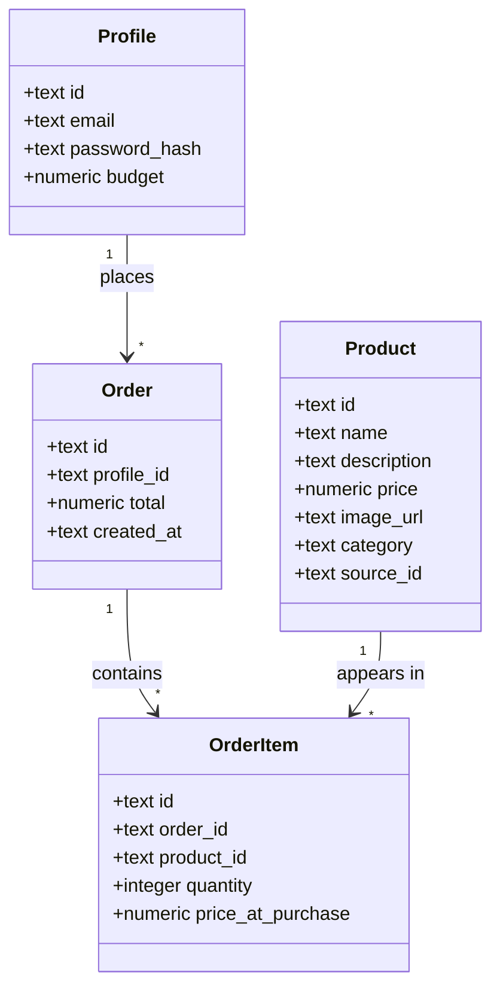

# Architecture

## Overview
```
Browser  <-->  Next.js app  <-->  SQLite (local file database)
```
Next.js serves the pages and reads/writes a single local database file (`data/app.db`) to check products, the buyer's budget, and save orders. There is no separate backend server and no cloud account to set up — the database is just a file created automatically the first time the app runs.

Login is hand-rolled rather than provided by a third party: passwords are hashed with `bcryptjs`, and once a buyer logs in, their session is stored in an encrypted browser cookie (`iron-session`) — no separate sessions table needed.

**Trade-off to know about:** because the database is a single local file, it only lives on whichever computer runs the app. It's not automatically shared between devices, and a serverless host like Vercel wouldn't keep the file around between requests. This setup is right for a Day 1 laptop demo; if this ever needs to run on a shared server, the database would need to move to a hosted service again.

## Data model (SQLite tables)

### Class diagram


**In plain English:**

There are four things the app needs to remember, matching the four ideas in the requirements (a buyer, a product, an order, and what's inside that order):

- **Profile** — one per buyer. Holds their login email, their password (as a one-way hash, never the plain password), and their budget (a single number that starts at a default and gets reduced as they spend). This is the "who" of the app.
- **Product** — one per furniture item in the catalogue (name, price, description, category, photo). Loaded in bulk from a MongoDB source catalogue via `scripts/sync-catalog-from-mongo.mjs`, not added by hand.
- **Order** — created the moment a buyer checks out. It records who placed it, when, and the total amount — but not *what* was in it (that's the next box).
- **OrderItem** — the line items of an order: which product, how many, and the price it was sold at. Splitting this out from Order means one order can contain many products, and each product can appear in many orders over time.

The arrows show "one can have many": one Profile can place many Orders; one Order is made up of many OrderItems; one Product can show up in many OrderItems (across different buyers' orders). Nothing points back the other way — a Product doesn't need to know which orders it's in, the OrderItem rows already record that link.

One deliberate simplification: the shopping **cart** isn't a database table at all. While the buyer is adding items and adjusting quantities, that only lives in the browser's temporary memory. It only becomes real, permanent rows (one Order + several OrderItems) the moment they hit "checkout." This keeps the data model small — no need to track abandoned or in-progress carts for a Day 1 build.

**profiles**
| column | type | notes |
|---|---|---|
| id | text (uuid) | |
| email | text | unique |
| password_hash | text | never store the plain password |
| budget | numeric | remaining budget, starts at a default value |

**products**
| column | type | notes |
|---|---|---|
| id | text (uuid) | |
| name | text | |
| description | text | |
| price | numeric | |
| image_url | text | |
| category | text | |
| source_id | text | id from the Mongo source catalogue; lets re-imports update instead of duplicate |

**orders**
| column | type | notes |
|---|---|---|
| id | text (uuid) | |
| profile_id | text | which buyer placed it |
| total | numeric | |
| created_at | text (timestamp) | |

**order_items**
| column | type | notes |
|---|---|---|
| id | text (uuid) | |
| order_id | text | |
| product_id | text | |
| quantity | integer | |
| price_at_purchase | numeric | so later price changes don't rewrite history |

Access rule: unlike a hosted database, SQLite has no built-in per-user access rules — the app code itself is responsible for only ever reading/writing a buyer's own `profiles`, `orders`, and `order_items` rows (every query is written to filter by the logged-in buyer's id).

## Pages (Next.js App Router)
| route | purpose | status |
|---|---|---|
| `/login` | sign up / log in | built |
| `/` | product catalogue (redirects here to `/login` if not logged in) | built |
| `/cart` | current cart, running total vs. remaining balance, checkout | built |
| `/orders` | past orders for the logged-in buyer, plus total spent | built |

## Key flows

**Login**
1. Buyer submits email/password on `/login`.
2. A server action looks up the `profiles` row by email and checks the password against the stored hash.
3. On success, the buyer's id is saved into an encrypted session cookie, and they're redirected to `/`.

**Browsing**
1. `/` loads and reads rows from the local `products` table (first 60, to keep the page light — there are hundreds of products).
2. Each product renders as a card (image, name, price, description) with an "Add to cart" button.

**Checkout with balance check**
1. Buyer adds products to the cart (kept in the browser via `localStorage`, not the database, until checkout — see `lib/cart-context.tsx`).
2. `/cart` shows each line item with a quantity stepper, the cart total, and the buyer's remaining balance (`profiles.budget` minus the total of their past orders — see `lib/balance.ts`).
3. If the cart total is more than the remaining balance, a clear message explains by how much, and the checkout button is disabled — the buyer must remove items to proceed.
4. If within budget, checkout calls the `placeOrder` server action (`app/cart/actions.ts`), which re-checks current prices and the balance itself (never trusting the browser's numbers), then creates one `orders` row and one `order_items` row per line item in a single transaction.

## Folder structure
```
my-furniture-buyer-app/
  app/
    login/page.tsx        # login/signup form
    login/actions.ts       # server actions: authenticate, logout
    page.tsx                # home page / product catalogue
    cart/page.tsx            # cart page (auth + balance guard, server component)
    cart/actions.ts           # server action: placeOrder (re-checks balance)
    layout.tsx
  components/
    ProductCard.tsx
    HeaderAuth.tsx          # login/logout state + remaining balance in the header
    CartLink.tsx              # cart item count link in the header
    CartClient.tsx             # interactive cart list, quantities, checkout
  lib/
    db.ts                    # opens the local SQLite file, applies schema
    session.ts                # reads/writes the encrypted session cookie
    products.ts                # Product type
    balance.ts                  # computes a buyer's remaining balance
    cart-context.tsx              # client-side cart state, backed by localStorage
  db/
    schema.sql                 # table definitions, applied automatically on startup
  scripts/
    sync-catalog-from-mongo.mjs   # one-off import from the MongoDB source catalogue
  data/
    app.db                         # the database file itself (not committed to git)
  requirements.md
  architecture.md
  CLAUDE.md
```

## Environment & deployment
- `.env.local` (never committed to git) holds `SESSION_SECRET` (encrypts the login cookie) and `MONGODB_URI` (only needed to re-run the catalogue import).
- The database itself needs no configuration — it's a file created on first run.
- Deployment target: running locally for the Day 1 demo. Deploying to a host like Vercel would need the database moved back to a hosted service (see the trade-off note above), since Vercel doesn't keep local files around between requests.
